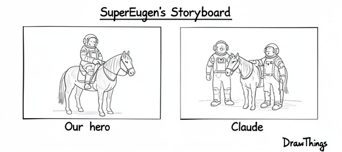
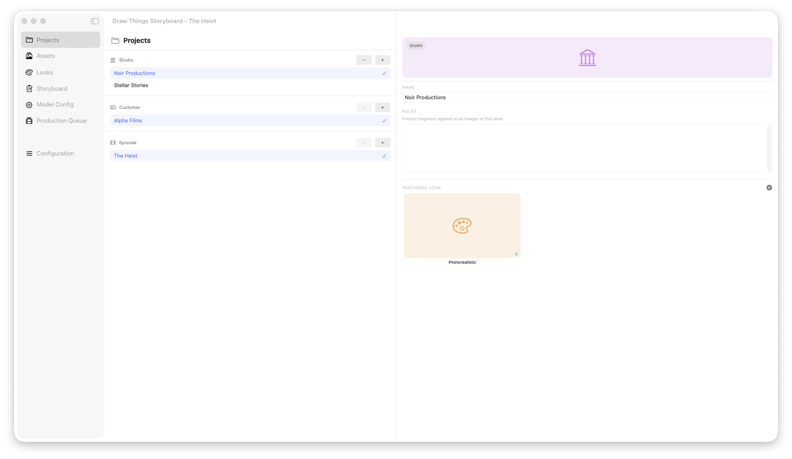

# DrawThingsStoryboard

A native macOS app for AI-assisted storyboard production, powered by [Draw Things](https://drawthings.ai).

DrawThingsStoryboard organises your visual storytelling workflow around a film production metaphor — from casting characters and locations, through writing scenes, to generating panels with AI. It talks to Draw Things over gRPC, so you get full access to ControlNet hints, moodboard reference images, and every model Draw Things supports.

## Features

- **Storyboard** — Act → Sequence → Scene → Panel hierarchy with camera movement, dialogue, and duration per panel
- **Assets** — Character and location library with variant generation (up to 4 variants per asset, approve workflow)
- **Styles** — Visual style templates (e.g. Photorealistic, Comic, Sketch) that assemble prompts; generates example images
- **Models** — Named Draw Things model configurations (model filename, steps, guidance scale, estimated gen times)
- **Production Queue** — Queued jobs with model picker, live generation progress, and done list with timing
- **Settings** — Image sizes, style preview prompt, panel duration defaults, shared secret
- **Flat JSON storage** — All data in 6 JSON files, all images as UUID.png in a single folder

## Screenshot



## Requirements

- macOS 14.0+
- Xcode 15+
- [Draw Things](https://drawthings.ai) with **gRPC API enabled** (Advanced → API Server → Protocol: gRPC)

## Getting Started

```bash
git clone https://github.com/SuperEugen/DrawThingsStoryboard.git
cd DrawThingsStoryboard
open DrawThingsStoryboard.xcodeproj
```

Build and run in Xcode (⌘R). On first launch the app creates default data in `~/Pictures/DrawThings-Storyboard/` including demo assets and styles.

### Draw Things configuration

In Draw Things, go to **Advanced → API Server** and set:

| Setting | Value |
|---------|-------|
| Server Online | enabled |
| Protocol | gRPC |
| Port | 7859 (default) |
| Transport Layer Security | enabled |

The app connects to `localhost:7859` with TLS by default.

## How It Works

### Data storage

All data lives in `~/Pictures/DrawThings-Storyboard/` as 6 JSON files plus UUID-named PNG images:

```
~/Pictures/DrawThings-Storyboard/
├── config.json          # App settings (image sizes, style prompt, shared secret)
├── models.json          # Draw Things model configurations
├── styles.json          # Visual styles with style prompts
├── storyboards.json     # Storyboard hierarchy (acts/sequences/scenes/panels)
├── assets.json          # Characters and locations with variants
├── production-log.json  # Log of all generated images
└── <UUID>.png           # All generated images (flat, no subfolders)
```

### Prompt assembly

Every generation job assembles its prompt from style description + item-specific text:

- **Style examples** — `style.style` + `config.stylePrompt`
- **Panels** — `style.style` + `panel.description`

### Panel generation and reference images

Panels can reference up to 4 assets (characters/locations) via ref1ID–ref4ID. These are passed to Draw Things as ControlNet shuffle hints (moodboard) and canvas image.

## Data Model

> Full source: [`docs/ER-Diagram-v0.7.mermaid`](docs/ER-Diagram-v0.7.mermaid)

```mermaid
erDiagram
    APPCONFIG {
        string grpcAddress
        string grpcPort
        string stylePrompt
        string characterTurnAround
        int smallImageWidth
        int smallImageHeight
        int largeImageWidth
        int largeImageHeight
        int defaultPanelDuration
        string pushoverToken
        string pushoverUser
    }

    MODELENTRY {
        string modelID PK
        string name
        string model
        int steps
        int guidanceScale
        string sampler
        int isImg2ImgCapable
        int defaultGenTimeSmall
        int defaultGenTimeLarge
    }

    STYLEENTRY {
        string styleID PK
        string name
        string style
        string smallImageID
        int isGenerated
    }

    STORYBOARDENTRY {
        string storyboardID PK
        string name
        string modelID FK
        string styleID FK
    }

    ACTENTRY {
        string actID PK
        string storyboardID FK
        string name
    }

    SEQUENCEENTRY {
        string sequenceID PK
        string actID FK
        string name
    }

    SCENEENTRY {
        string sceneID PK
        string sequenceID FK
        string name
    }

    PANELENTRY {
        string panelID PK
        string sceneID FK
        string name
        string description
        string cameraMovement
        string dialogue
        int duration
        int seed
        string smallImageID
        string largeImageID
        string ref1ID
        string ref2ID
        string ref3ID
        string ref4ID
    }

    ASSETENTRY {
        string assetID PK
        string name
        string type
        string subType
        string description
    }

    ASSETSTYLEVARIANT {
        string assetID FK
        string styleID FK
        string largeImageID
        int approvedVariantIndex
        int approvedSeed
    }

    ASSETVARIANT {
        string assetID FK
        string styleID FK
        int slot
        string smallImageID
        int seed
        int isApproved
    }

    GENERATIONJOB {
        string id PK
        string itemName
        string jobType
        string size
        string modelID FK
        string styleID FK
        string assetID FK
        string panelID FK
        int seed
        int width
        int height
        string combinedPrompt
    }

    GENERATEDIMAGEENTRY {
        string imageID PK
        string type
        string modelID FK
        string styleID FK
        string size
        int seed
        string combinedPrompt
        string startTime
        string endTime
    }

    STORYBOARDENTRY ||--o{ ACTENTRY : "contains"
    ACTENTRY ||--o{ SEQUENCEENTRY : "contains"
    SEQUENCEENTRY ||--o{ SCENEENTRY : "contains"
    SCENEENTRY ||--o{ PANELENTRY : "contains"

    MODELENTRY ||--o{ STORYBOARDENTRY : "used by"
    STYLEENTRY ||--o{ STORYBOARDENTRY : "applied to"

    ASSETENTRY ||--o{ ASSETSTYLEVARIANT : "has"
    STYLEENTRY ||--o{ ASSETSTYLEVARIANT : "scopes"
    ASSETSTYLEVARIANT ||--o{ ASSETVARIANT : "holds"

    PANELENTRY }o--o{ ASSETENTRY : "references"

    MODELENTRY ||--o{ GENERATIONJOB : "used by"
    STYLEENTRY ||--o{ GENERATIONJOB : "used by"
    ASSETENTRY ||--o{ GENERATIONJOB : "generates"
    PANELENTRY ||--o{ GENERATIONJOB : "generates"

    MODELENTRY ||--o{ GENERATEDIMAGEENTRY : "logged for"
    STYLEENTRY ||--o{ GENERATEDIMAGEENTRY : "logged for"
```



## Project Structure

```
DrawThingsStoryboard/
├── App/                    # Entry point, sidebar, ContentView
├── Features/
│   ├── Assets/             # Assets browser and detail editor
│   ├── Styles/             # Styles browser and detail editor
│   ├── Models/             # Models browser and detail editor
│   ├── Storyboard/         # Act/Sequence/Scene/Panel views
│   ├── ProductionQueue/    # Queue browser and job detail with generation
│   ├── Settings/           # App settings (SettingsContentView)
│   ├── ImageGeneration/    # ViewModel and generation logic
│   └── Shared/             # UnifiedThumbnailView and helpers
├── Models/                 # DataModels.swift, GenerationJob, Request/Response
└── Services/
    ├── DrawThingsClient/   # gRPC, HTTP, and mock clients
    └── Storage/            # StorageService, StorageSetupService, StorageLoadService
```

## Dependencies

| Package | Purpose |
|---------|--------|
| [euphoriacyberware-ai/DT-gRPC-Swift-Client](https://github.com/euphoriacyberware-ai/DT-gRPC-Swift-Client) | Draw Things gRPC client (grpc-swift, swift-protobuf, flatbuffers) |

> [!NOTE]
> Add the package in Xcode via **File → Add Package Dependencies** using the URL above.

## Contributing

See [CONTRIBUTORS.md](CONTRIBUTORS.md).
